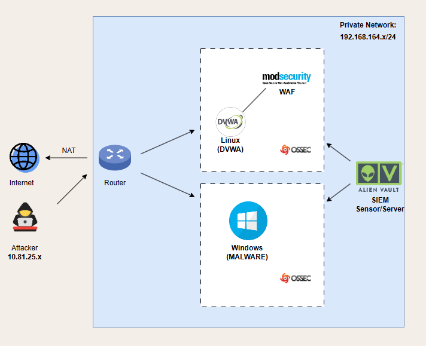

# OSSIM AlienVault
## Overview
This project aims to set up a virtualized environment using VMWare, incorporating OSSIM AlienVault Sensor and Server, a simple web DVWA with Kali Linux. The goal is to integrate the web server with AlienVault through the Kali Linux host using the AlienVault SIEM tool.

## Prerequisites
- VMWare installed
- Downloaded OSSIM AlienVault Sensor and Server from the AT&T Security website
- Basic knowledge of networking and virtualization concepts
- Hosting DVWA in Kali Linux

## Proposed scheme

