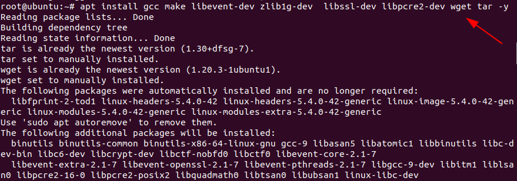
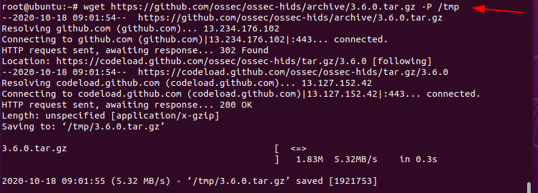
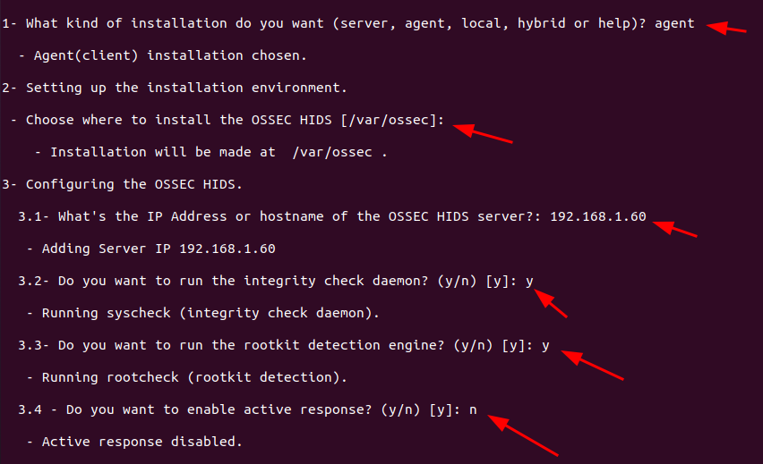
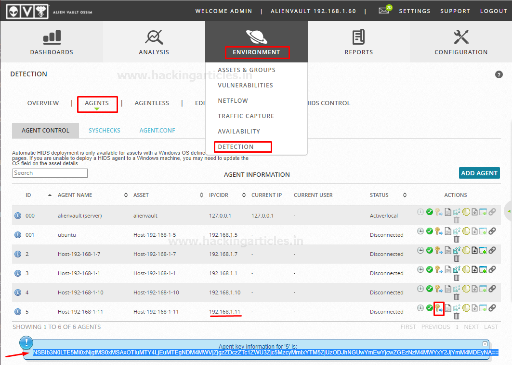
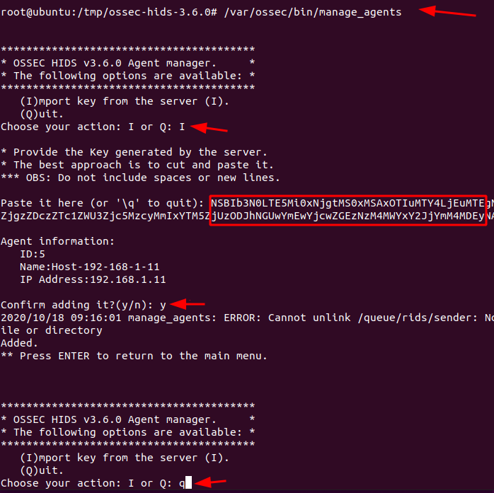
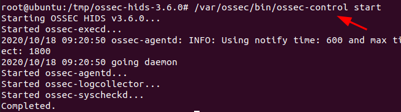

# OSSIM AlienVault
# Overview
This project aims to set up a virtualized environment using VMWare, incorporating OSSIM AlienVault Sensor and Server, a simple web DVWA with Kali Linux. The goal is to integrate the web server with AlienVault through the Kali Linux host using the AlienVault SIEM tool.

# Prerequisites
- VMWare installed
- Downloaded OSSIM AlienVault Sensor and Server from the AT&T Security website
- Basic knowledge of networking and virtualization concepts
- Hosting DVWA in Kali Linux
- Download OSSEC Source code

# Proposed scheme


# Deployment
## 1. Deploying OSSEC Agent on Kali Linux
To deploy OSSEC Agent, we need to download some requirement before agent installation as listed below:
 - GCC
 - Make
 - Libevent-dev
 - Zlib-dev
 - Libssl-dev
 - Libpcre2-dev
 - Wget
 - Tar
We can download this all requirement by simply running this command:

```shell
apt install gcc make libevent-dev zlib1g-dev  libssl-dev libpcre2-dev wget tar
```


After that download the latest OSSEC source code from the Official [release page](https://github.com/ossec/ossec-hids/releases) or simply running this command:

```shell
wget https://github.com/ossec/ossec-hids/archive/3.6.0.tar.gz -P /tmp
```


Once the source download complete you can extract it by simply running this command:

```shell
cd /tmp
tar xzf 3.6.0.tar.gz
```

In manner to install OSSEC agent navigate to the source code directory and run the installation script as shown below
```shell
cd ossec-hids-3.6.0/
./install.sh
```

Further then select your installation language or press ENTER to choose default installation options and follow the steps as described below: –
 - Specify the type of installation. In our case we are installing an OSSEC-HIDS agent, so we go with the option of the agent.
 - Choose the installation path. By default, it is /var/ossec or you can define the path as per your environment.
 - Enter the OSSEC-HIDS server IP or AlienVault server IP.
 - Enable the system integrity check.
 - Enable rootkit detection.
 - Enable or disable active directory response.
 - Once you are done with defining the default options, proceed to install the OSSEC agent by pressing ENTER
 - Then after press ENTER to close the installer as shown below



## 2. Deploying OSSEC agent to AlienVault Server
In a manner the agent to communicate with the server

  - You need to first add it to the HIDS server or AlienVault server
  - After that extract, the agent authentication key from the AlienVault server

To extract agent key from server, go to the AlienVault Web UI and then navigate to Environment > Detection. Then select or add Agent where you installed OSSEC agent and then extract or copy the key as shown below: –



Once you have extracted the key, Import the key on the agent simply by running the following command: 

```shell
/var/ossec/bin/manage_agents
```

Enter I, paste the key that you copied from AlienVault Web UI and confirm adding the key then exit from the window by pressing Q as shown below:



Once the installation completes starting the OSSEC agent simply by running the following command:

```shell
/var/ossec/bin/ossec-control start
```

or

```shell
systemctl start ossec
```



To stop the agent run the below command

```shell
/var/ossec/bin/ossec-control stop
```

or

```shell
systemctl stop ossec
```

Other service control commands are described below.

```shell
/var/ossec/bin/ossec-control {start|stop|reload|restart|status}
```

Check the logs to see if the agent has connected to the server.

```shell
tail -f /var/ossec/logs/ossec.log
```

As you can see the agent is successfully connected to the AlienVault server

We have successfully deployed our Ubuntu machine to the AlienVault server
